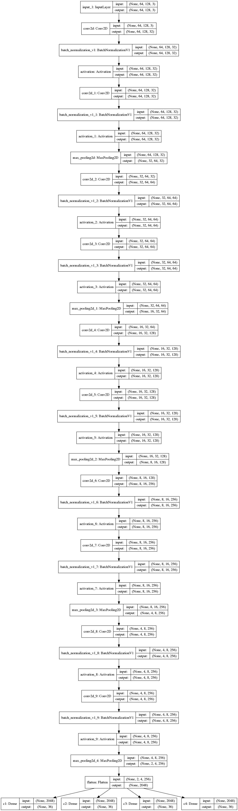
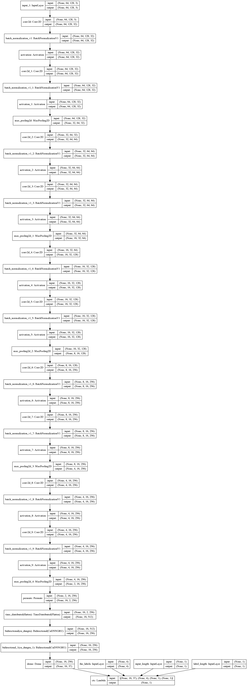
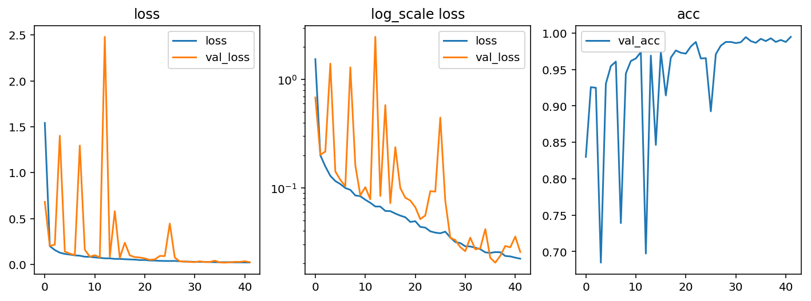

# 使用深度学习来破解 captcha 验证码

本项目会通过 Keras 搭建一个深度卷积神经网络来识别 captcha 验证码，建议使用显卡来运行该项目。

下面的可视化代码都是在 `jupyter notebook` 中完成的，如果你希望写成 python 脚本，稍加修改即可正常运行，当然也可以去掉这些可视化代码。

2019 年更新了：

* 适配了新版 API
* 提高了数据生成器的效率
* 使用了 CuDNNGRU 提高了训练和预测效率
* 更新了文档

# 环境

本项目使用的环境如下：

* captcha 0.3
* tensorflow-gpu 1.13.1
* numpy 1.16.4
* tqdm 4.28.1

下面几个包是用于可视化的：

* matplotlib 2.2.2
* pandas 0.23.0
* pydot 1.4.1
* graphviz 2.38.0-12ubuntu2.1

# captcha

captcha 是用 python 写的生成验证码的库，它支持图片验证码和语音验证码，我们使用的是它生成图片验证码的功能。

首先我们设置我们的验证码格式为数字加大写字母，生成一串验证码试试看：

```py
from captcha.image import ImageCaptcha
import matplotlib.pyplot as plt
import numpy as np
import random

%matplotlib inline
%config InlineBackend.figure_format = 'retina'

import string
characters = string.digits + string.ascii_uppercase
print(characters)

width, height, n_len, n_class = 170, 80, 4, len(characters)

generator = ImageCaptcha(width=width, height=height)
random_str = ''.join([random.choice(characters) for j in range(4)])
img = generator.generate_image(random_str)

plt.imshow(img)
plt.title(random_str)

```


# 防止 tensorflow 占用所有显存

众所周知 tensorflow 默认占用所有显存，这样不利于我们同时进行多项实验，因此我们可以使用下面的代码当 tensorflow 使用它需要的显存，而不是直接占用所有显存。

```py
import tensorflow as tf
import tensorflow.keras.backend as K

config = tf.ConfigProto()
config.gpu_options.allow_growth=True
sess = tf.Session(config=config)
K.set_session(sess)
```

# 数据生成器

训练模型的时候，我们可以选择两种方式来生成我们的训练数据，一种是一次性生成几万张图，然后开始训练，一种是定义一个数据生成器，然后利用 `fit_generator` 函数来训练。

第一种方式的好处是训练的时候显卡利用率高，如果你需要经常调参，可以一次生成，多次使用；第二种方式的好处是你不需要生成大量数据，训练过程中可以利用 CPU 生成数据，而且还有一个好处是你可以无限生成数据。

我们的数据格式如下：

## X

X 的形状是 `(batch_size, height, width, 3)`，比如一批生成 128 个样本，图片宽度为170，高度为80，那么 X 的形状就是 `(128, 64, 128, 3)`，如果你想取第一张图，代码可以这样写 `X[0]`。

## y

y 的形状是四个 `(batch_size, n_class)`，如果转换成 numpy 的格式，则是 `(n_len, batch_size, n_class)`，比如一批生成 128 个样本，验证码的字符有 36 种，长度是 4 位，那么它的形状就是 4 个 `(128, 36)` 的矩阵，也可以说是 `(4, 32, 36)`。

## 数据生成器

为了让 Keras 能够使用多进程并行生成数据，我们需要使用 Keras 的 Sequence 类实现一个我们自己的数据类。

在 `__init__` 初始化函数里，我们定义数据所需的参数，然后这个数据的长度就是 steps 数。在 `__getitem__` 里，我们不用理会索引号，直接随机生成一批样本送去训练即可。

```py
from tensorflow.keras.utils import Sequence

class CaptchaSequence(Sequence):
    def __init__(self, characters, batch_size, steps, n_len=4, width=128, height=64):
        self.characters = characters
        self.batch_size = batch_size
        self.steps = steps
        self.n_len = n_len
        self.width = width
        self.height = height
        self.n_class = len(characters)
        self.generator = ImageCaptcha(width=width, height=height)
    
    def __len__(self):
        return self.steps

    def __getitem__(self, idx):
        X = np.zeros((self.batch_size, self.height, self.width, 3), dtype=np.float32)
        y = [np.zeros((self.batch_size, self.n_class), dtype=np.uint8) for i in range(self.n_len)]
        for i in range(self.batch_size):
            random_str = ''.join([random.choice(self.characters) for j in range(self.n_len)])
            X[i] = np.array(self.generator.generate_image(random_str)) / 255.0
            for j, ch in enumerate(random_str):
                y[j][i, :] = 0
                y[j][i, self.characters.find(ch)] = 1
        return X, y
```

# 使用生成器

生成器的使用方法很简单，只需要用对它取第一个 batch 即可。下面是一个例子，初始化一个数据集，设置 batch_size 和 steps 都为 1，然后取出来第一个数据，对它可视化。

在这里我们对生成的  One-Hot 编码后的标签进行了解码，首先将它转为 numpy 数组，然后取36个字符中最大的数字的位置（axis=2代表字符的轴），实际上神经网络会输出36个字符的概率，我们需要将概率最大的四个字符的编号取出来，转换为字符串。

```py
def decode(y):
    y = np.argmax(np.array(y), axis=2)[:,0]
    return ''.join([characters[x] for x in y])

data = CaptchaSequence(characters, batch_size=1, steps=1)
X, y = data[0]
plt.imshow(X[0])
plt.title(decode(y))
```

# 构建深度卷积神经网络

```py
from tensorflow.keras.models import *
from tensorflow.keras.layers import *

input_tensor = Input((height, width, 3))
x = input_tensor
for i, n_cnn in enumerate([2, 2, 2, 2, 2]):
    for j in range(n_cnn):
        x = Conv2D(32*2**min(i, 3), kernel_size=3, padding='same', kernel_initializer='he_uniform')(x)
        x = BatchNormalization()(x)
        x = Activation('relu')(x)
    x = MaxPooling2D(2)(x)

x = Flatten()(x)
x = [Dense(n_class, activation='softmax', name='c%d'%(i+1))(x) for i in range(n_len)]
model = Model(inputs=input_tensor, outputs=x)
```

模型结构很简单，特征提取部分使用的是两个卷积，一个池化的结构，这个结构是学的 VGG16 的结构。我们重复五个 block，然后我们将它 Flatten，连接四个分类器，每个分类器是36个神经元，输出36个字符的概率。

# 模型可视化

得益于 Keras 自带的可视化，我们可以使用几句代码来可视化模型的结构：

```py
from tensorflow.keras.utils import plot_model
from IPython.display import Image

plot_model(model, to_file='cnn.png', show_shapes=True)
Image('cnn.png')
```

这里需要使用 pydot 这个库，以及 graphviz 这个库，在 macOS 系统上安装方法如下：

```sh
brew install graphviz
pip install pydot-ng
```



我们可以看到最后一层卷积层输出的形状是 `(1, 6, 256)`，已经不能再加卷积层了。

# 训练模型

训练模型反而是所有步骤里面最简单的一个，直接使用 `model.fit_generator` 即可，这里的验证集使用了同样的生成器，由于数据是通过生成器随机生成的，所以我们不用考虑数据是否会重复。

为了避免手动调参，我们使用了 Adam 优化器，它的学习率是自动设置的，我们只需要给一个较好的初始学习率即可。

EarlyStopping 是一个 Keras 的 Callback，它可以在 loss 超过多少个 epoch 没有下降以后，就自动终止训练，避免浪费时间。

ModelCheckpoint 是另一个好用的 Callback，它可以保存训练过程中最好的模型。

CSVLogger 可以记录 loss 为 CSV 文件，这样我们就可以在训练完成以后绘制训练过程中的 loss 曲线。

注意，这段代码在笔记本电脑上可能要较长时间，建议使用带有 NVIDIA 显卡的机器运行。注意我们这里使用了一个小技巧，添加 `workers=4` 参数让 Keras 自动实现多进程生成数据，摆脱 python 单线程效率低的缺点。

```py
from tensorflow.keras.callbacks import EarlyStopping, CSVLogger, ModelCheckpoint
from tensorflow.keras.optimizers import *

train_data = CaptchaSequence(characters, batch_size=128, steps=1000)
valid_data = CaptchaSequence(characters, batch_size=128, steps=100)
callbacks = [EarlyStopping(patience=3), CSVLogger('cnn.csv'), ModelCheckpoint('cnn_best.h5', save_best_only=True)]

model.compile(loss='categorical_crossentropy',
              optimizer=Adam(1e-3, amsgrad=True), 
              metrics=['accuracy'])
model.fit_generator(train_data, epochs=100, validation_data=valid_data, workers=4, use_multiprocessing=True,
                    callbacks=callbacks)
```

### 载入最好的模型继续训练一会

为了让模型充分训练，我们可以载入之前最好的模型权值，然后降低学习率为原来的十分之一，继续训练，这样可以让模型收敛得更好。

```py
model.load_weights('cnn_best.h5')

callbacks = [EarlyStopping(patience=3), CSVLogger('cnn.csv', append=True), 
             ModelCheckpoint('cnn_best.h5', save_best_only=True)]

model.compile(loss='categorical_crossentropy',
              optimizer=Adam(1e-4, amsgrad=True), 
              metrics=['accuracy'])
model.fit_generator(train_data, epochs=100, validation_data=valid_data, workers=4, use_multiprocessing=True,
                    callbacks=callbacks)
```

# 测试模型

当我们训练完成以后，可以识别一个验证码试试看：

```py
X, y = data[0]
y_pred = model.predict(X)
plt.title('real: %s\npred:%s'%(decode(y), decode(y_pred)))
plt.imshow(X[0], cmap='gray')
plt.axis('off')
```


# 计算模型总体准确率

模型在训练的时候只会显示每一个字符的准确率，为了统计模型的总体准确率，我们可以写下面的函数：

```py
from tqdm import tqdm
def evaluate(model, batch_num=100):
    batch_acc = 0
    with tqdm(CaptchaSequence(characters, batch_size=128, steps=100)) as pbar:
        for X, y in pbar:
            y_pred = model.predict(X)
            y_pred = np.argmax(y_pred, axis=-1).T
            y_true = np.argmax(y, axis=-1).T

            batch_acc += (y_true == y_pred).all(axis=-1).mean()
    return batch_acc / batch_num

evaluate(model)
```

这里用到了一个库叫做 tqdm，它是一个进度条的库，为的是能够实时反馈进度。然后我们通过一些 numpy 计算去统计我们的准确率，这里计算规则是只要有一个错，那么就不算它对。经过计算，我们的模型的总体准确率在经过充分训练以后，可以达到 98.26% 的总体准确率。

# 模型总结

模型的大小是10.7MB，总体准确率是 98.26%，基本上可以确定破解了此类验证码。

# 改进

对于这种按顺序书写的文字，我们还有一种方法可以使用，那就是循环神经网络来识别序列。下面我们来了解一下如何使用循环神经网络来识别这类验证码。

# CTC Loss

这个 loss 是一个特别神奇的 loss，它可以在只知道序列的顺序，不知道具体位置的情况下，让模型收敛。这里有一个非常好的文章介绍了 CTC Loss: [Sequence Modeling
With CTC](https://distill.pub/2017/ctc/)


在 Keras 里面已经内置了 CTC Loss ，我们实现下面的代码即可在模型里使用 CTC Loss。

* `y_pred` 是模型的输出，是按顺序输出的37个字符的概率，因为我们这里用到了循环神经网络，所以需要一个空白字符的概念；
* `labels` 是验证码，是四个数字，每个数字代表字符在字符集里的位置
* `input_length` 表示 `y_pred` 的长度，我们这里是16
* `label_length` 表示 `labels` 的长度，我们这里是4

```py
import tensorflow.keras.backend as K

def ctc_lambda_func(args):
    y_pred, labels, input_length, label_length = args
    return K.ctc_batch_cost(labels, y_pred, input_length, label_length)
```

# 模型结构

我们的模型结构是这样设计的，首先通过卷积神经网络去识别特征，然后按水平顺序输入到 GRU 进行序列建模，最后使用一个分类器对每个时刻输出的特征进行分类。

```py
from tensorflow.keras.models import *
from tensorflow.keras.layers import *

input_tensor = Input((height, width, 3))
x = input_tensor
for i, n_cnn in enumerate([2, 2, 2, 2, 2]):
    for j in range(n_cnn):
        x = Conv2D(32*2**min(i, 3), kernel_size=3, padding='same', kernel_initializer='he_uniform')(x)
        x = BatchNormalization()(x)
        x = Activation('relu')(x)
    x = MaxPooling2D(2 if i < 3 else (2, 1))(x)

x = Permute((2, 1, 3))(x)
x = TimeDistributed(Flatten())(x)

rnn_size = 128
x = Bidirectional(CuDNNGRU(rnn_size, return_sequences=True))(x)
x = Bidirectional(CuDNNGRU(rnn_size, return_sequences=True))(x)
x = Dense(n_class, activation='softmax')(x)

base_model = Model(inputs=input_tensor, outputs=x)
```

为了训练这个模型，我们还需要搭建一个 loss 计算网络，代码如下：

```py
labels = Input(name='the_labels', shape=[n_len], dtype='float32')
input_length = Input(name='input_length', shape=[1], dtype='int64')
label_length = Input(name='label_length', shape=[1], dtype='int64')
loss_out = Lambda(ctc_lambda_func, output_shape=(1,), name='ctc')([x, labels, input_length, label_length])

model = Model(inputs=[input_tensor, labels, input_length, label_length], outputs=loss_out)
```

真正训练出来的模型是 `base_model`，由于 Keras 的限制，我们没办法直接使用 `base_model` 搭建 CTCLoss，所以我们只能按照上面的方法，让模型直接输出 loss。

# 模型可视化

可视化的代码同上，这里只贴图。



可以看到模型比上一个模型复杂了许多，但实际上只是因为输入比较多，所以它显得很大。

首先模型输入一个 `(height, width, 3)` 维度的图片，然后经过一系列的层降维到了 `(2, 16, 256)`，之后我们使用 Permute 把 width 轴调整到第一个维度以适配 RNN 的输入格式。调整以后的维度是 `(16, 2, 256)`，然后使用 `TimeDistributed(Flatten())` 把后两个维度压成一维，也就是 `(16, 512)`，之后经过 2 层双向的 GRU 对序列横向建模，最后经过 Dense 分类器输出水平方向上每个字符的概率分布。

使用 CuDNNGRU 是因为它在 NVIDIA 显卡上可以加速非常多倍，如果你使用的是 CPU，改为 GRU 即可。

使用 RNN 的原因是，如果你看到一句话是 `今天我*了一个非常好吃的苹果`，有一个字看不清，你很容易猜到这个字是“吃”，但是使用 CNN，你就很难有这么大的感受野，从苹果推测出前面的字是吃。

# 数据生成器

数据生成器和 CNN 的差不多，这里需要多几个矩阵，一个是 input_length，代表序列长度，一个是 label_length，代表验证码长度，还有一个 np.ones，没有意义，只是为了适配 Keras 训练需要的矩阵输入。

```py
from tensorflow.keras.utils import Sequence

class CaptchaSequence(Sequence):
    def __init__(self, characters, batch_size, steps, n_len=4, width=128, height=64, 
                 input_length=16, label_length=4):
        self.characters = characters
        self.batch_size = batch_size
        self.steps = steps
        self.n_len = n_len
        self.width = width
        self.height = height
        self.input_length = input_length
        self.label_length = label_length
        self.n_class = len(characters)
        self.generator = ImageCaptcha(width=width, height=height)
    
    def __len__(self):
        return self.steps

    def __getitem__(self, idx):
        X = np.zeros((self.batch_size, self.height, self.width, 3), dtype=np.float32)
        y = np.zeros((self.batch_size, self.n_len), dtype=np.uint8)
        input_length = np.ones(self.batch_size)*self.input_length
        label_length = np.ones(self.batch_size)*self.label_length
        for i in range(self.batch_size):
            random_str = ''.join([random.choice(self.characters) for j in range(self.n_len)])
            X[i] = np.array(self.generator.generate_image(random_str)) / 255.0
            y[i] = [self.characters.find(x) for x in random_str]
        return [X, y, input_length, label_length], np.ones(self.batch_size)
```

# 评估模型

```py
from tqdm import tqdm

def evaluate(model, batch_size=128, steps=20):
    batch_acc = 0
    valid_data = CaptchaSequence(characters, batch_size, steps)
    for [X_test, y_test, _, _], _ in valid_data:
        y_pred = base_model.predict(X_test)
        shape = y_pred.shape
        out = K.get_value(K.ctc_decode(y_pred, input_length=np.ones(shape[0])*shape[1])[0][0])[:, :4]
        if out.shape[1] == 4:
            batch_acc += (y_test == out).all(axis=1).mean()
    return batch_acc / steps
```

我们会通过这个函数来评估我们的模型，和上面的评估标准一样，只有全部正确，我们才算预测正确，中间有个坑，就是模型最开始训练的时候，并不一定会输出四个字符，所以我们如果遇到所有的字符都不到四个的时候，就不计算了，相当于加0，遇到多于4个字符的时候，只取前四个。

# 评估回调

因为 Keras 没有针对这种输出计算准确率的选项，因此我们需要自定义一个回调函数，它会在每一代训练完成的时候计算模型的准确率。

```py
from tensorflow.keras.callbacks import Callback

class Evaluate(Callback):
    def __init__(self):
        self.accs = []
    
    def on_epoch_end(self, epoch, logs=None):
        logs = logs or {}
        acc = evaluate(base_model)
        logs['val_acc'] = acc
        self.accs.append(acc)
        print(f'\nacc: {acc*100:.4f}')
```

# 训练模型

我们还是按照之前的训练策略，先训练 100 代，等 loss 不降低以后，降低学习率，再训练 100 代，代码如下：

```py
from tensorflow.keras.callbacks import EarlyStopping, CSVLogger, ModelCheckpoint
from tensorflow.keras.optimizers import *

train_data = CaptchaSequence(characters, batch_size=128, steps=1000)
valid_data = CaptchaSequence(characters, batch_size=128, steps=100)
callbacks = [EarlyStopping(patience=5), Evaluate(), 
             CSVLogger('ctc.csv'), ModelCheckpoint('ctc_best.h5', save_best_only=True)]

model.compile(loss={'ctc': lambda y_true, y_pred: y_pred}, optimizer=Adam(1e-3, amsgrad=True))
model.fit_generator(train_data, epochs=100, validation_data=valid_data, workers=4, use_multiprocessing=True,
                    callbacks=callbacks)
```

```py
model.load_weights('ctc_best.h5')

callbacks = [EarlyStopping(patience=5), Evaluate(), 
             CSVLogger('ctc.csv', append=True), ModelCheckpoint('ctc_best.h5', save_best_only=True)]

model.compile(loss={'ctc': lambda y_true, y_pred: y_pred}, optimizer=Adam(1e-4, amsgrad=True))
model.fit_generator(train_data, epochs=100, validation_data=valid_data, workers=4, use_multiprocessing=True,
                    callbacks=callbacks)
```



可以看到 loss 一开始下降很快，后面就很平了，但是我们把在对数尺度下绘制 loss 图的话，还是能看到 loss 一直在下降的。acc 上升得也很快，虽然前期训练的时候 acc 很抖动，但是后期学习率降下来以后就不会再跌下来了。

最终模型的准确率达到了 99.21%，训练过程中的准确率最高达到了 99.49%。

# 测试模型

```py
characters2 = characters + ' '
[X_test, y_test, _, _], _  = data[0]
y_pred = base_model.predict(X_test)
out = K.get_value(K.ctc_decode(y_pred, input_length=np.ones(y_pred.shape[0])*y_pred.shape[1], )[0][0])[:, :4]
out = ''.join([characters[x] for x in out[0]])
y_true = ''.join([characters[x] for x in y_test[0]])

plt.imshow(X_test[0])
plt.title('pred:' + str(out) + '\ntrue: ' + str(y_true))

argmax = np.argmax(y_pred, axis=2)[0]
list(zip(argmax, ''.join([characters2[x] for x in argmax])))
```

这里随机出来的验证码很厉害，是`O0OP`，不过更厉害的是模型认出来了。


# 有趣的问题

我又用之前的模型做了个测试，对于 `O0O0` 这样丧心病狂的验证码，模型偶尔也能正确识别，这让我非常惊讶，它是真的能识别 O 与 0 的差别呢，还是猜出来的呢？这很难说。

```py
generator = ImageCaptcha(width=width, height=height)
random_str = 'O0O0'
X = generator.generate_image(random_str)
X = np.expand_dims(X, 0) / 255.0

y_pred = base_model.predict(X)
out = K.get_value(K.ctc_decode(y_pred, input_length=np.ones(y_pred.shape[0])*y_pred.shape[1], )[0][0])[:, :4]
out = ''.join([characters[x] for x in out[0]])

plt.title('real: %s\npred:%s'%(random_str, out))
plt.imshow(X[0], cmap='gray')
```


# 总结

模型的大小是12.8MB，准确率达到了惊人的 99.21%，即使连 0 和 O 都能精准区分，非常成功。

# 扩展

如果你比较喜欢 PyTorch，可以看 [ctc_pytorch.ipynb](ctc_pytorch.ipynb)，精度更高，达到了 99.57%。

如果你想查看更多经验，可以看看我在百度云魅族深度学习应用大赛的代码和思路：[https://github.com/ypwhs/baiduyun_deeplearning_competition](https://github.com/ypwhs/baiduyun_deeplearning_competition)

# 参考链接

* [https://keras.io/getting-started/functional-api-guide/](https://keras.io/getting-started/functional-api-guide/)
* [https://www.tensorflow.org/api_docs/python/tf/nn/ctc_loss](https://www.tensorflow.org/api_docs/python/tf/nn/ctc_loss)
* [https://github.com/keras-team/keras/blob/master/examples/image_ocr.py](https://github.com/keras-team/keras/blob/master/examples/image_ocr.py)
* [https://cs231n.github.io/convolutional-networks/](https://cs231n.github.io/convolutional-networks/)
* [https://distill.pub/2017/ctc/](https://distill.pub/2017/ctc/)
